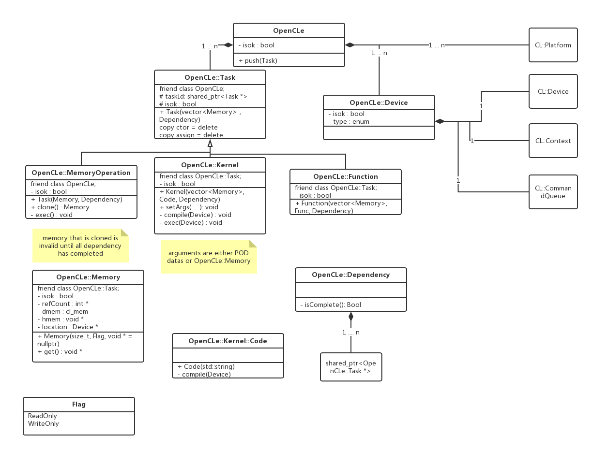

# Project-OpenCLe

## Development guide

- OpenCLe: a singleton RAII object. Underlining implementation is OpenCL and contain all necessary recourse for OpenCL. When a Task is pushed, OpenCLe will automatic decide when and which devices run the task.

- Task: a Task can be either device-side task (called Kernel), host-side task (called Function), or a memory operation.

- Dependency: the dependency of a task. 